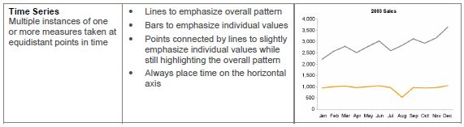

# Training-visualisation
Visualisation development as part of my training
# SUMMARY

My goal is to provide a visualization showing how flight delays have evolved, based on United States department of Transportation  data which records total flights and total delays in minutes, by arrival airport and carrier. The visualization, which is my first project in HTML, relies on open source software and should be understandable by non-technical people: how are the flight delays evolving?

## Importation of data

I used the Bureau of Transportation statistics website and downloaded flights data for the last 4 years (2015-2018), for all carriers and all US airports.
I performed data exploration in R to understand the data structure. I detected an increase in flights arrival delays over the biggest airports, which is the data story I want to illustrate.

 

The R notebook flights.rmd  is used to go from my raw data file, flights.csv, to the filtered data files
myflight.csv, the one I use for visualization, and myairports.csv for additional user information.

## Design decisions : first iteration

Because I want to show an evolution over time, I will use a line chart, to enhance the perception of trends. As I am looking at an evolution over time, time will be on the horizontal axis as is generally recommended, eg by Stephen Few in “The Right graph”. The flight delay is then on the y axis.

 

Being new to html and its useage in visualization, I decided to use dimple.
The initial version, project0.html, showed the total amount of minutes lost, on a line chart to show tendency.

 

## Design decisions : second iteration

I updated the R program to compute average delays, and add a line in the data for all biggest airports data together, including the overall average delay. Here in R:

 

When I decided to include the possibility to view multiple airports, I needed a third encoding, color.
I also planned, if I could, to provide an individual view of each airport –either by animation or on user interaction, as a view with 20 airports together at the same time would be confusing, as shown in R:

 

I used http://dimplejs.org/examples_viewer.html?id=lines_horizontal_stacked as a initial source code.
For filtering data, https://github.com/PMSI-AlignAlytics/dimple/wiki/dimple#filterData 
I added markers to allow finding the tooltips more easily.
I wanted to assign a specific width and color to the all airports line to make it stand out. The difficulty is that dimple does the work to style each series of data, but does not facilitate changing the style for a particular value in the series. I had to use D3 to make it. The method I used was inspired from
https://stackoverflow.com/questions/39291542/is-it-possible-to-highlight-bars-in-dimple-js-bar-chart-based-on-y-axis-value
This is a picture of projectv1.html used for the second iteration

 

## Design decisions : final design

I found a way to make interactive legends for a bar chart on dimplejs.org. I needed to adapt it to my line chart, and to have airports deselected at the start of the user interaction.
I put in place also an initial animation, showing first all airports delays, then removing airports to keep only the average of all airports for the user to contemplate (this makes the global trend more visible by reducing the vertical scale, and on top brings a visual metaphor to the “slowly rising” message).
The user can then select the airport he wants to show or hide, by clicking on the buttons.
As not all users would be familiar with airport codes, I added a list of airport codes and names down on the page.For this I used a function developed by jfreels https://gist.github.com/jfreels/6814721.
I also added a header quoting the source of data. 

## Feedback : first iteration

First user feedback was
-it makes more sense to show an average flight delay, rather than a total number of minutes over all flights. 
-the unit of the y axis itself is mysterious (‘m’ in fact meant million of minutes…)
-it is difficult to catch the data point where the tooltip is accessible, there needs to be a marker
-the title is centered on the page while the chart was fixed to the left, leading to a title too far on the right

## Feedback : second iteration
First user feedback :
-easier to understand, and to “grab” the tooltip
-fonts used are small !

Second user feedback was
-is it possible not to show everything at the same time, eg to show average first, then all ?
-a list of airport codes and names would help

Third user feedback:
-needs a legend to know what we are showing (airports)
-20 lines is a lot, it would help to be able to select what we show

Fourth user feedback
-why not show box plot (user is a datascientist, not representative of general population!)
-y axis is not fully used, zooming would make delay increase more apparent (but it would trick the viewer)

## Feedback : final design
Fist and second user:
Great improvement from the initial design !

